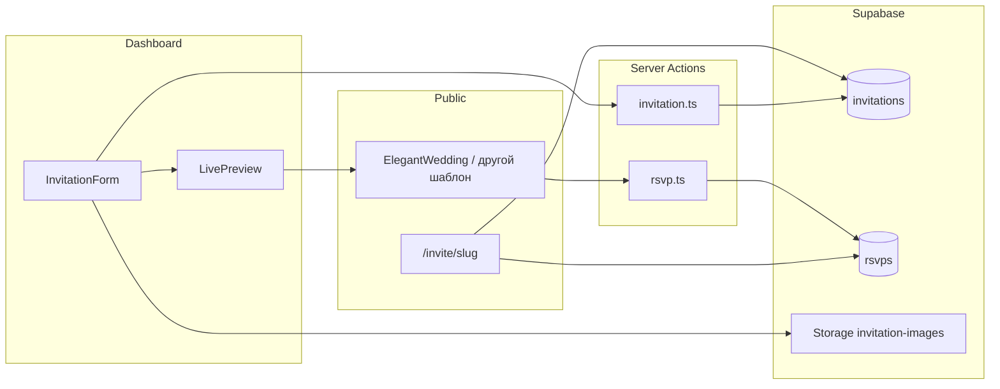

# Гайд: шаблоны приглашений, форма и интеграция с Supabase

Документ описывает, **как в ToiBer устроены шаблоны** (на примере `ElegantWedding`), как они связаны с **формой в дашборде** и с **бэкендом Supabase** (таблицы, storage, server actions).

---

## 1. Модель данных в Supabase

### Таблица `invitations`

Строка приглашения хранит всё, что нужно и для редактирования, и для публичной страницы:

| Поле | Назначение |
|------|------------|
| `id` | UUID, первичный ключ. Нужен для RSVP и для ссылок вида `/dashboard/edit/[id]`. |
| `user_id` | Владелец (FK на `auth.users`). RLS ограничивает CRUD только своими записями. |
| `slug` | Уникальный фрагмент URL: публичная страница — `/invite/[slug]`. |
| `template_id` | Строковый идентификатор шаблона оформления (например `elegant-wedding`). Определяет, **какой React-компонент** рендерить на `/invite/[slug]`. |
| `data` | **JSONB** — объект контента приглашения. В коде типизирован как `InvitationData` (`types.ts`). |
| `status` | `draft` \| `published`. Публичная выдача только для `published` (см. раздел 4). |
| `created_at`, `updated_at` | Метаданные. |

Итог: **форма в дашборде редактирует не «поля таблицы напрямую», а в первую очередь объект `data` + `slug` + при создании `template_id`.**

### Таблица `rsvps`

| Поле | Назначение |
|------|------------|
| `invitation_id` | Связь с `invitations.id`. |
| `name`, `status` (`yes` / `no`), `comment` | Ответ гостя. |

Вставка с публичной страницы идёт через server action (см. раздел 6). Выборка для блока «пожелания» — по `invitation_id`.

### Storage

- Бакет **`invitation-images`**: загрузка с авторизованного пользователя, публичный URL попадает в `InvitationData.heroImageUrl` и `InvitationData.galleryImages[]`.

---

## 2. Контракт шаблона: `InvitationData` и строка `Invitation`

Файл: `types.ts`.

**`InvitationData`** — единый контракт «что мы собираем в форме и что отдаём в шаблон»:

- `groomName`, `brideName`
- `eventDate`, `eventTime`
- `location`, `locationUrl`
- `description`
- `galleryImages: string[]`
- `giftInfo`
- `heroImageUrl`

**`Invitation`** — полная строка из БД: `id`, `user_id`, `slug`, `template_id`, `data`, `status`, даты.

### Функциональный контракт компонента шаблона (как у `ElegantWedding`)

Шаблон верхнего уровня — обычный React-компонент, который:

1. Принимает **`data: InvitationData`** — всё содержимое из JSONB.
2. Принимает **`invitationId: string`** — UUID из Supabase; нужен форме RSVP (скрытое поле + server action).
3. Принимает **`rsvps: RSVP[]`** — для секции пожеланий / отображения ответов (на публичной странице приходят реальные данные; в превью билдера — пустой массив).

Пример интерфейса (упрощённо):

```ts
interface WeddingTemplateProps {
  data: InvitationData;
  invitationId: string;
  rsvps: RSVP[];
}
```

Внутри шаблон **сам решает**, из каких секций состоит страница: например `HeroSection`, `CountdownTimer`, `EventDetails`, `Gallery`, `GiftInfo`, `GuestWishes`, `RSVPForm` — всё в `components/templates/...`.

**Важно:** если новый шаблон требует **дополнительных полей**, их нужно:

1. Добавить в `InvitationData` в `types.ts`.
2. Добавить поля в форму `InvitationForm` (шаги «Данные» / «Фото» и т.д.).
3. Обновить `defaultData` и при необходимости валидацию в `createInvitation` / `updateInvitation`.

Пока все шаблоны используют один и тот же JSON — один общий тип удобнее, чем отдельная схема на каждый шаблон (можно позже ввести дискриминатор по `template_id` и union-типы).

---

## 3. Поток данных: дашборд → Supabase

### Где форма

- Создание: `app/dashboard/create/page.tsx` → `<InvitationForm />`.
- Редактирование: `app/dashboard/edit/[id]/page.tsx` загружает приглашение через Supabase и передаёт `<InvitationForm existing={invitation} />`.

### Состояние в `InvitationForm`

- `templateId` — выбранный шаблон (сейчас в UI по сути один вариант — `elegant-wedding`).
- `data: InvitationData` — зеркало того, что уйдёт в колонку `data`.
- `slug` — человекочитаемая часть URL.

### Server actions: `app/actions/invitation.ts`

| Функция | Что делает |
|---------|------------|
| `createInvitation(data, templateId, slug)` | Проверка пользователя, нормализация/уникальность `slug`, `insert` в `invitations` с `status: 'draft'`. |
| `updateInvitation(id, data, slug?)` | `update` строки своего приглашения: JSON `data`, опционально `slug`. |
| `uploadImage(formData)` | Загрузка файла в Storage `invitation-images`, возврат публичного URL; форма подставляет URL в `data`. |
| `publishInvitation` / `unpublishInvitation` | Меняют `status` (с дашборда, через карточку). |
| `deleteInvitation` | Удаление своей записи. |

Клиент формы вызывает эти функции из `"use client"` компонента — это стандартный паттерн Next.js App Router (**Server Actions**).

### Предпросмотр

`components/dashboard/LivePreview.tsx` получает только `data: InvitationData` и рендерит **тот же шаблон**, что и публичная страница (сейчас жёстко `ElegantWedding`), с:

- `invitationId="preview"` — фиктивный id, чтобы не создавать RSVP в БД с превью (в продакшене имеет смысл не отправлять форму при `preview` или валидировать на сервере).

---

## 4. Поток данных: публичная страница `/invite/[slug]`

Файл: `app/invite/[slug]/page.tsx`.

1. **Загрузка приглашения** — Supabase server client:
   - `from('invitations').select('*').eq('slug', slug).eq('status', 'published').single()`
   - Если нет строки → `notFound()`.

2. **Загрузка RSVP** — `from('rsvps').select('*').eq('invitation_id', id)` для блока пожеланий.

3. **Рендер шаблона** — сейчас **всегда** монтируется `ElegantWedding` с пропсами:
   - `data={invitation.data}`
   - `invitationId={invitation.id}`
   - `rsvps={rsvps}`

### Метаданные и SEO

`generateMetadata` использует `invitation.data` (имена, дата, `heroImageUrl` для OG) — без привязки к конкретному JSX шаблона, только к данным.

### Как подключить второй шаблон (паттерн интеграции)

1. Создать компонент, например `EditorialIvory.tsx`, с тем же контрактом пропсов, что и `ElegantWedding`.
2. В `app/invite/[slug]/page.tsx` вместо прямого импорта одного шаблона сделать разветвление:

   ```tsx
   function InvitationView({ invitation, rsvps }: { invitation: Invitation; rsvps: RSVP[] }) {
     const props = { data: invitation.data, invitationId: invitation.id, rsvps };
     switch (invitation.template_id) {
       case "editorial-ivory":
         return <EditorialIvory {...props} />;
       case "elegant-wedding":
       default:
         return <ElegantWedding {...props} />;
     }
   }
   ```

3. В `LivePreview` передавать ещё и `templateId` и рендерить тот же `switch`, чтобы превью совпадало с публикацией.

4. В `InvitationForm` при выборе шаблона сохранять тот же `template_id`, что в `switch`.

Так **бэкенд остаётся одним** (одна таблица, одно поле `template_id`); меняется только презентационный слой.

---

## 5. Секции внутри шаблона

`ElegantWedding` — композиция из `components/templates/sections/*`:

- Каждая секция получает **уже разобранные** куски `data` (строки, массивы URL) — шаблон верхнего уровня выступает «склейкой».
- Секции могут быть `"use client"` там, где нужны таймер, форма, локальный state (`CountdownTimer`, `RSVPForm`).

Новый шаблон может:

- переиспользовать те же секции с другими классами Tailwind;
- или ввести свои секции в той же папке / подпапке по имени шаблона.

---

## 6. RSVP и Supabase

### Клиент

`RSVPForm` (`components/templates/sections/RSVPForm.tsx`):

- держит локальный state (отправка, ошибка, успех);
- в форму кладёт скрытое поле `invitationId`;
- вызывает `submitRSVP(formData)` из `app/actions/rsvp.ts`.

### Сервер

`submitRSVP`:

- валидирует поля;
- `createClient()` из `@/lib/supabase/server`;
- `insert` в `rsvps` с `invitation_id`, `name`, `status`, `comment`.

Политики RLS в Supabase должны разрешать **вставку** RSVP для опубликованных приглашений и **чтение** владельцу приглашения — это на стороне SQL в проекте Supabase, не в этом репозитории.

---

## 7. Аутентификация и доступ

- **Дашборд** защищён `middleware.ts`: без сессии Supabase редирект на `/auth`.
- **Операции с `invitations`** в server actions проверяют `auth.getUser()` и фильтруют по `user_id`.
- **Публичная страница** не требует логина; данные — только опубликованное приглашение по `slug`.

---

## 8. Краткая схема (mermaid)



---

## 9. Чеклист для нового шаблона «как у ElegantWedding»

1. Реализовать компонент с пропсами `data`, `invitationId`, `rsvps`.
2. При необходимости расширить `InvitationData` и форму в дашборде.
3. Зарегистрировать `template_id` в UI выбора шаблона и в `switch` на `/invite/[slug]` + `LivePreview`.
4. Проверить: создание, редактирование, публикация, копирование ссылки, RSVP, загрузку фото.
5. Обновить `generateMetadata` при появлении шаблон-специфичных полей для SEO.

---

## 10. Связанные файлы в репозитории

| Назначение | Путь |
|------------|------|
| Типы | `types.ts` |
| Шаблон-обёртка | `components/templates/ElegantWedding.tsx` |
| Секции | `components/templates/sections/*.tsx` |
| Публичная страница | `app/invite/[slug]/page.tsx` |
| Форма + превью | `components/dashboard/InvitationForm.tsx`, `LivePreview.tsx` |
| CRUD и загрузка | `app/actions/invitation.ts` |
| RSVP | `app/actions/rsvp.ts`, `components/templates/sections/RSVPForm.tsx` |
| Supabase server client | `lib/supabase/server.ts` |

---

*Версия документа: 1.0 (соответствует состоянию кодовой базы на момент составления).*
